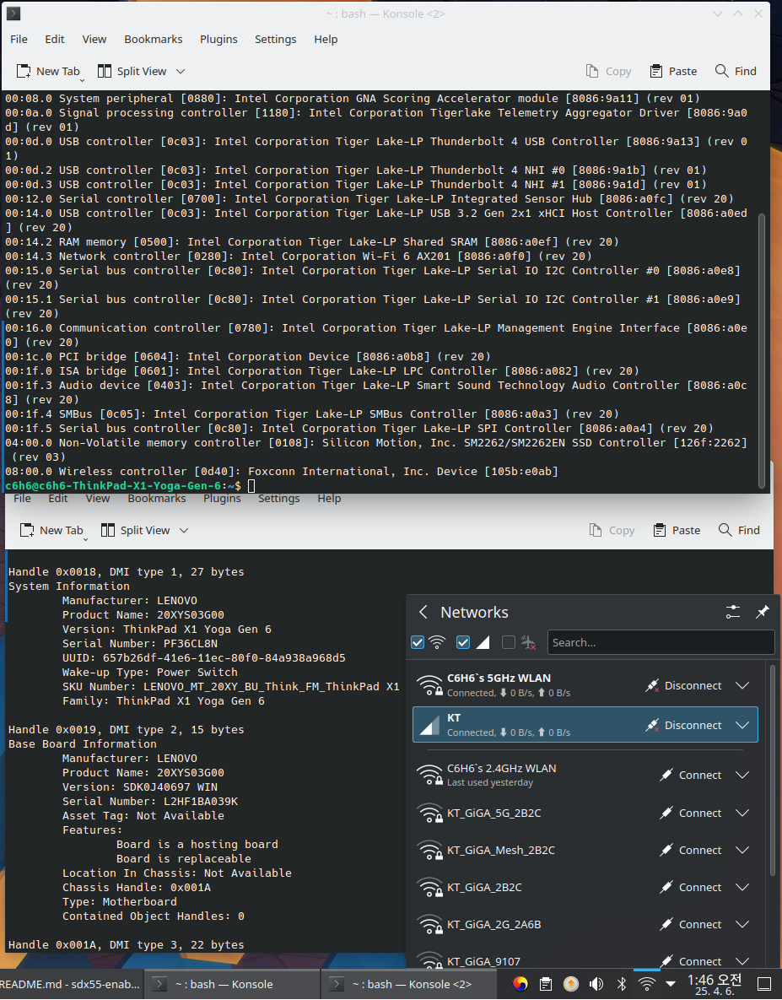
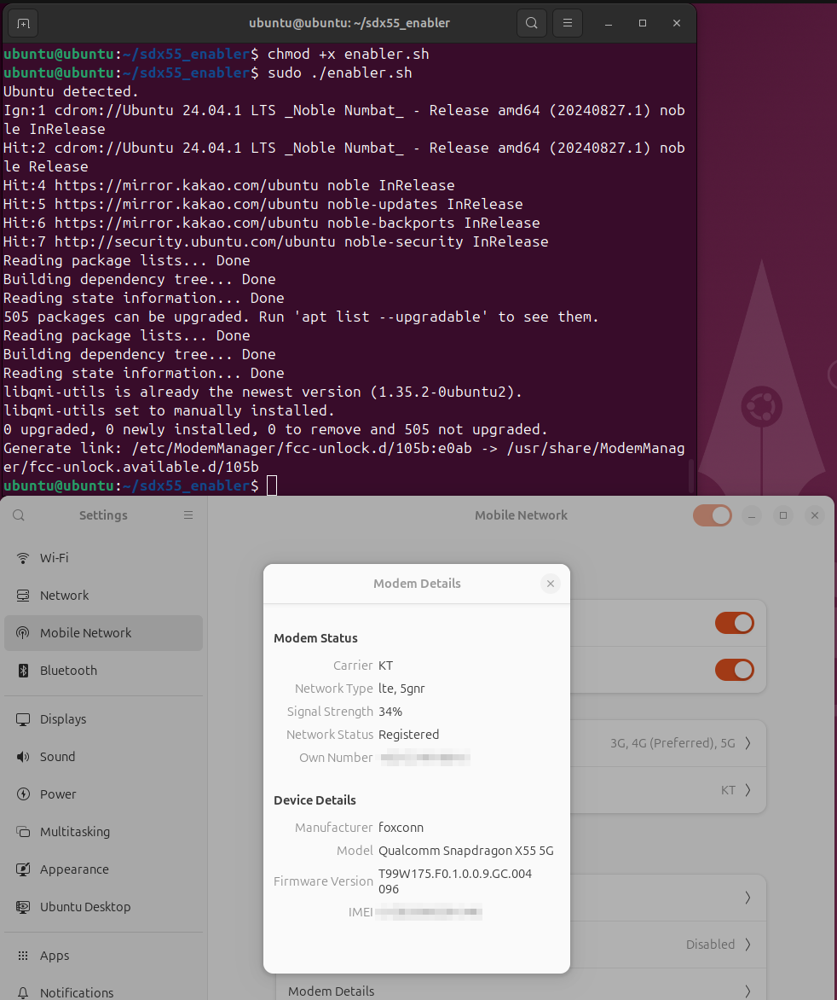
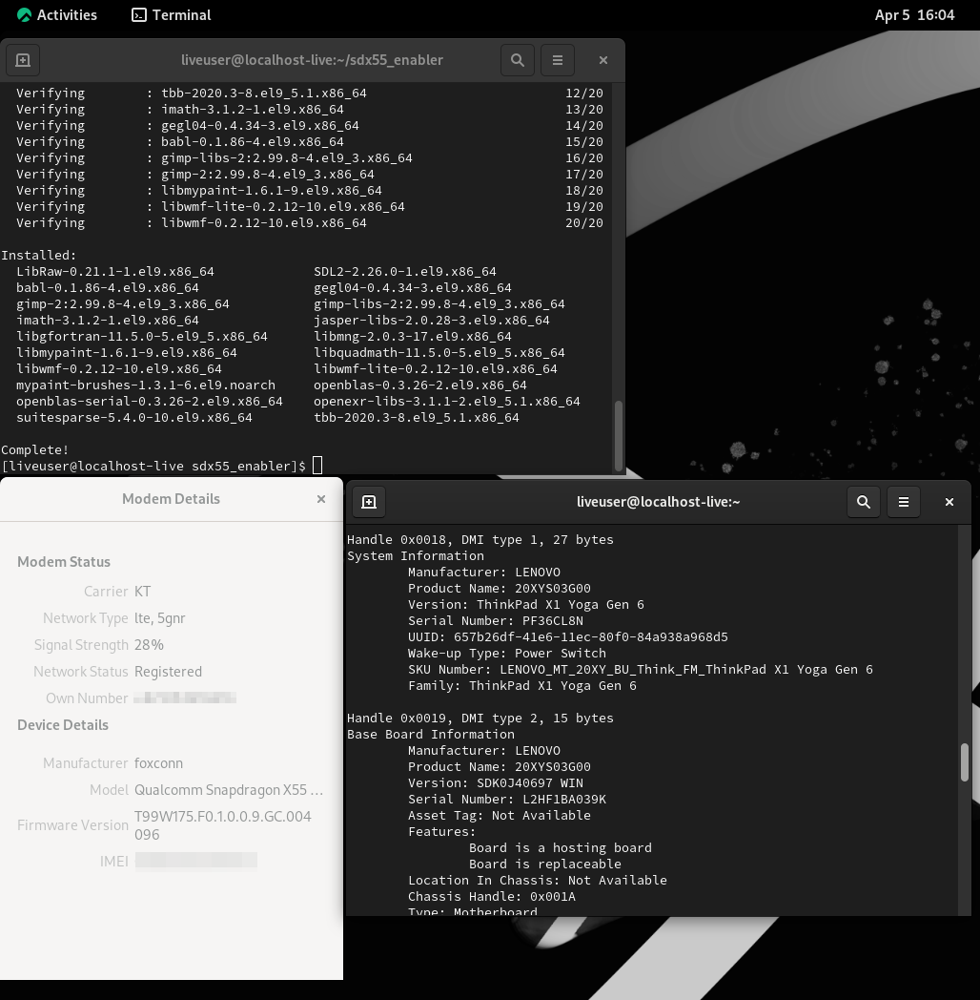

## SDX55-enabler

Qualcomm SDX55 modem enabler for Thinkpad Series

### What is it?

This is the Qualcomm SDX55 modem enabler for Thinkpad Series.

Target is for...

WAN Module: Foxconn SDX55

Target machines:

- ThinkPad X1 Yoga Gen 6
- ThinkPad X1 Carbon Gen 9
- ThinkPad X1 Nano Gen 1
- ThinkPad X1 Nano Gen 2
- IOT Edge SE-30

Supported disros:

- Ubuntu
- Fedora
- Rocky Linux
- Red Hat Enterprise Linux (RHEL)
- EndeavourOS

### Detailed Information

It automatically detects distros and install **libqmi-utils** packages for obtain **qmicli** command.

After that, automatically generate symbolic link to provide fcc-unlock algorithm to modemmanager.

For EndeavourOS, it installs ModemManager automatically, and register ModemManager service that runs every boot.

### How to use?

```sh
git clone https://github.com/C6H6Vita/sdx55_enabler.git
chmod +x enabler.sh
sudo ./enabler.sh
```

You will need to take a reboot after running **./enabler.sh** command.

### Tested environment

This software tested on these distros:

- Ubuntu 22.04
- Ubuntu 24.04
- Fedora 37 (After full upgrade, cannot connect 5G)
- Fedora 38
- Fedora 39
- Fedora 40
- Rocky Linux 9
- RHEL 9.5
- EndeavourOS (25. 04 . 06 rolling release)

This software tested on theser hardwares:

- Qualcomm SDX 55 5G modem
- Thinkpad X1 yoga Gen 6
- PCI ID : 105b:e0ab (Vendor ID: 105B, Product ID E0AB)

### Screenshot






